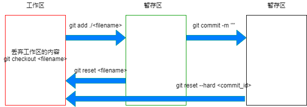

git三种状态的转换



git状态切换时的常用命令

```bash
1. git管理工作目录
	git init  # 会增加.git文件夹
2. git的三种状态
	工作区
	暂存区
	本地仓库
3. 提交到暂存区
	git add ./<filename>
4. 提交到本地仓库
	git commit -m ""
5. 查看工作树的状态
	git status
6. 查看所有提交的版本信息
	git log
7. 查看所有的操作记录
	git reflog
8. 丢弃工作区的内容
	git checkout <filename>
9. 从暂存区到工作区
	git reset <filename>
10. 版本回退, 不动文件内容
	git reset <commit_id>
11. 版本回退, 文件内容也改变
	git reset --hard <commit_id>
```

git分支管理

```bash
1. 创建分支
	git branch <branch_name>
2. 切换分支
	git checkout <branch_name>
3. 删除分支
	git branch -d <branch_name>
4. 查看所有分支
	git branch
5. 把分支合并到当前分支
	git merge <branch_name>
6. 合并分支出现冲突时
	手动解决冲突,然后提交到本地仓库
```

git标签管理

```bash
1. 创建标签
	git tag <tag_name> <commit_id>
2. 查看所有标签
	git tag
3. 删除标签
	git tag -d <tag_name>
```

git连接到远程仓库github

```bash
1. 连接远程仓库的方式
	https和ssh两种方式, ssh快
2. SSH连接远程仓库
	在本地用户目录下生成公钥和私钥: ssh-keygen -t rsa -C '邮箱地址'
	.ssh目录下存放了生成的公钥和私钥, 把公钥(id_rsa.pub)放入到github上
3. 添加远程仓库
	git remote add 别名 ssh地址
4. 推送代码到远程仓库
	git push -u 别名 分支 (第一次推送时加-u)
5. 克隆仓库
	git clone 仓库地址
6. 从远程仓库拉取
	git pull origin 分支
```

git协同开发

```bash
线上的分支
线上的保险分支, 即备份分支
开发分支, 即每个人的分支
在自己的分支下开发
	先提交到测试分支, 测试通过, 提交到自己的远程仓库分支
线上出现bug
	回滚到之前稳定的版本
	建立bug分支, 在bug分支解决bug
```

