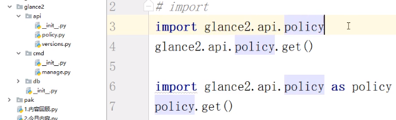

## 导入模块和包

### 导入模块

**import的过程中发生了哪些事情？**

1. 寻找模块
2. 如果找到，开辟一块空间，执行这个模块
3. 把这个模块中用到的名字都收录到开辟的空间中
4. 创建一个变量来引用这个模块的空间

**注意：**

1. 模块不会被重复导入
2. 模块和文件之间的内存空间始终是隔离的
3. 模块名字必须符合变量命名规范
4. 模块之间不能循环引用，即A中导入B， B中有导入A

**模块搜索路径**

​	一个模块能否被导入，就看这个模块所在的目录是否在sys.path中

​	正常的sys.path中除了内置、扩展模块所在的路径外，只有一个路径永远不会出问题，就是直接执行的这个文件所在的目录

**模块和脚本**

	1. 直接运行时，为脚本，`__name__ = __main__`
 	2. 导入时，为模块, `__name__ = 模块名`

**pyc文件**

​	提前编译好的字节码，只能提高程序的启动效率， 并不能提高程序的执行效率

**dir(模块名)**

​	可以获取这个模块中的所有名字

### 导入包

**什么是包？**

​	含有一个`__init__.py`的文件夹就是一个包，通常包中含有一些py文件

#### 从包中导入模块

​	**import导入**

​	 `.`的左面必须是一个包，终点必须是一个模块

​	

​	**from import导入**

```python
from glance2.api import policy
policy.get()

from glance2.api.policy import get
get()
```

#### 直接导入包

**导入包的过程中发生了哪些事情？**

​	导入包，相当于执行了这个包的`__init__.py`文件

**绝对导入**

```python
from glance2.api.versions import create_resource
```

**相对导入**	

```python
from ..cmd import manage
```

​	运用了相对导入的文件不能被直接执行，即相对导入只能在包内部使用
