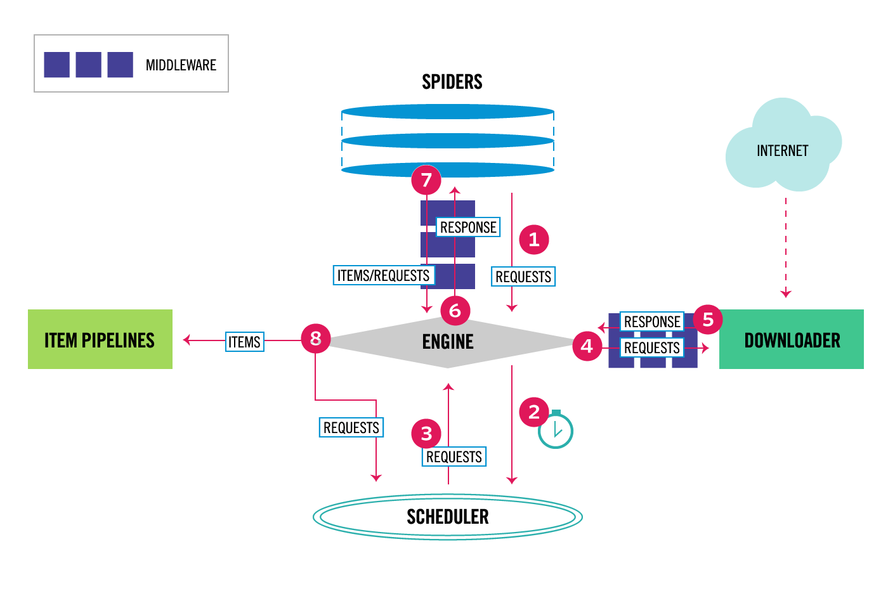

  scrapy是一个为了爬取网站数据, 提取结构性数据而编写的应用框架, 它是基于Twisted框架开发而来, 而Twisted框架是事件驱动的, 比较适合异步代码. 对会阻塞线程的操作, 包括访问数据库、文件或者web, 或者产生新的进程并需要处理新进程的输出、执行系统层次操作的代码, Twisted提供了允许执行上面的操作但不会阻塞代码执行的方法.

## scrapy五大核心组件

- **引擎(ENGINE)**:  用来处理整个系统的数据流, 触发事务, 是框架的核心.
- **调度器(Scheduler)**: 用来接收引擎发过来的请求, 压入队列中, 并在引擎再次请求的时候返回, 可以看成是一个url的优先队列, 由它来决定下一个要抓取的网址是什么, 同时也会去除重复的网址.
- **下载器(Downloader)**: 用于下载网页内容, 并将网页内容返回给引擎, 下载器是建立在高效异步的twisted模型上的.
- **爬虫(Spiders)**: 用于从特定的网页中提取自己需要的信息, 也可以从中提取链接, 让scrapy继续抓取下一个页面.
- **管道(Pipelines)**: 负责处理爬虫从网页中抽取到的实体item, 持久化实体, 验证实体的有效性, 清除不需要的信息, 当页面被爬虫解析后, 将被发送到项目管道, 并经过几个特定的次序处理数据.

## scrapy的流程

1. 爬虫SPIDERS将初始请求交给引擎ENGINE.

2. 引擎ENGINE获取到初始请求, 并交给调度器SCHEDULER.

3. 调度器SCHEDULER处理后返回一个请求给引擎ENGINE.

4. 引擎ENGINE将请求经下载中间件MIDDLEWARES发送到下载器DOWNLOADER, 下载页面数据.

5. 一旦下载器完成页面下载, 就会将下载结果通过下载中间件MIDDLEWARES返回给引擎ENGINE.

6. 引擎ENGINE将获取到的响应通过爬虫中间件MIDDLEWARES返回给爬虫SPIDERS进行处理.

7. 爬虫SPIDERS处理响应, 并通过中间件MIDDLEWARES返回处理后的items, 或新的请求给引擎.

8. 引擎ENGINE发送处理后的items到项目管道PIPELINES, 进行持久化存储; 如果是新的请求则传给调度器SCHEDULER.

9. 重复该过程, 直到爬取完所有的url请求.

   

## scrapy命令

```bash
# 创建项目
scrapy startproject name

# 创建爬虫程序
scrapy genspider jd_search  search.jd.com

# 启动爬虫程序
scrapy crawl jd_search --nolog

# 存储数据结果到文件
scrapy crawl jd_search -o jd_search.xml
```

## scrapy的配置

```python
# 设置日志等级, 只记录error
LOG_LEVEL = 'ERROR'

# UA, 也可以在下载中间件中设置
USER_AGENT = 'Mozilla/5.0 (Windows NT 6.1; Win64; x64) AppleWebKit/537.36 (KHTML, like Gecko) Chrome/85.0.4183.83 Safari/537.36'

# robot协议
ROBOTSTXT_OBEY = False

# 开启管道
ITEM_PIPELINES = {
   'scrapy_demo.pipelines.ScrapyDemoPipeline': 300,      # 数字表示优先级, 数字越小, 优先级越高
}

# 开启下载中间件
DOWNLOADER_MIDDLEWARES = {
   'jdSpiderPro.middlewares.JdspiderproDownloaderMiddleware': 543,
}
# 设置下载延迟
DOWNLOAD_DELAY = 5

# 设置并发线程数
CONCURRENT_REQUESTS = 64

# 禁用cookie
COOKIES_ENABLED = False

```


